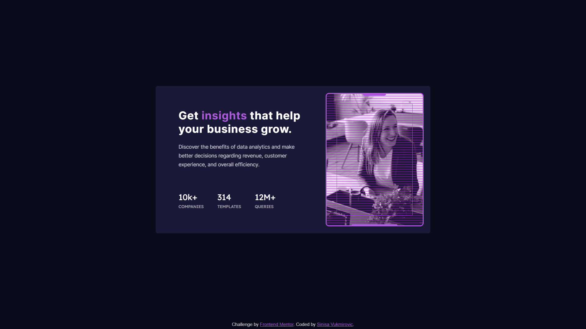

# Frontend Mentor Spicy mini - Stats preview card component solution

This is a SPICED UP solution to the [Stats preview card component challenge on Frontend Mentor](https://www.frontendmentor.io/challenges/stats-preview-card-component-8JqbgoU62)

## Table of contents

- [Overview](#overview)
  - [Screenshot](#screenshot)
  - [Links](#links)
- [Author](#author)
- [Acknowledgments](#acknowledgments)

## Overview

### The challenge

### Screenshot

### Links

- Solution URL: [CODE](https://github.com/SinisaVukmirovic/FrontEnd-Mentor-Spicy-mini-6)
- Live Site URL: [DEMO](https://sinisavukmirovic.github.io/FrontEnd-Mentor-Spicy-mini-6/)

## Author

- Website - [Sinisa Vukmirovic](https://github.com/SinisaVukmirovic)
- Frontend Mentor - [@SinisaVukmirovic](https://www.frontendmentor.io/profile/SinisaVukmirovic)
- Twitter - [@sajtowski](https://twitter.com/sajtowski)

## Acknowledgments

- This guy - HYPERPLEXED. Genius! (https://www.youtube.com/c/Hyperplexed)